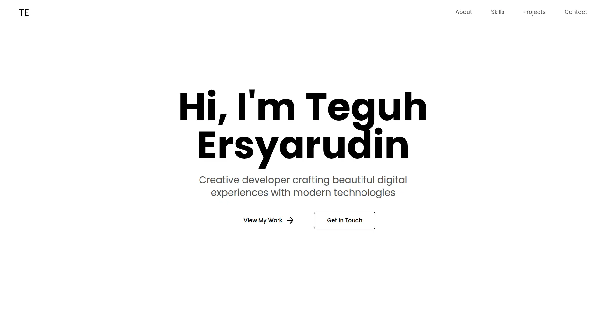

# Simple Svelte + Vite starter for ghoodev projects — a small personal/site boilerplate with components, hooks and services.



<!-- Badges -->
[](https://svelte.dev) [](https://vitejs.dev) [](./LICENSE)

## Quick demo

The image above is the hero/header used in the project. Place your hero file at `image.webp` (or update the path in the layout) and GitHub will render it in this README.

## Features

- ⚡ Svelte + Vite starter
- 🧩 Small component set (Loading spinner)
- 🔌 Simple hooks and service layer (see `src/lib/hooks` and `src/lib/services`)
- 🧭 Layouts under `src/layouts` and routes in `src/routes`

## Getting started

Install dependencies and run the dev server:

```bash
npm install
npm run dev
```

Build for production and preview:

```bash
npm run build
npm run preview
```

## License

MIT — see `LICENSE`.